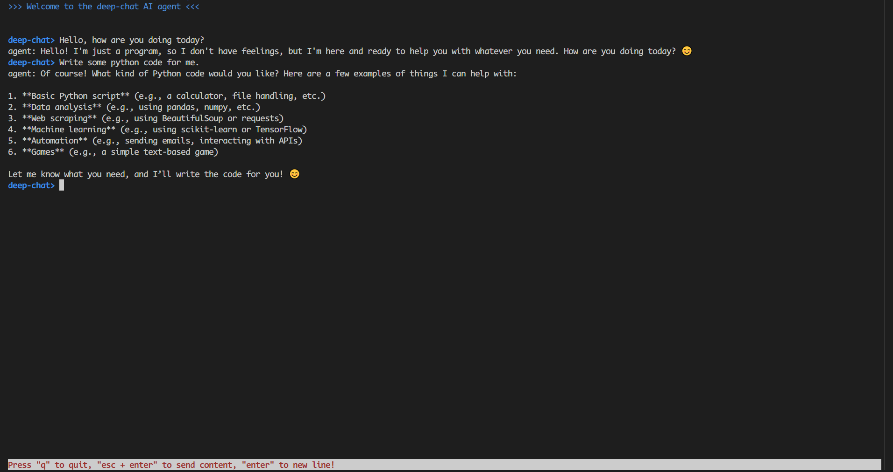

# What is deep chat
Deep chat is a agent in terminal
# How to use
Firstly, install the environment follow this
```Python
pip install -r "requirements.txt"
```
Than, you can just run it and start chatting in your terminal after inputting your api_key follow this code in DeepChat.py
```Python
 client = OpenAI(
            api_key="xxx",
            base_url="https://api.deepseek.com",
        )
```
Finally, you can see the chat UI in the terminal like follow image.
